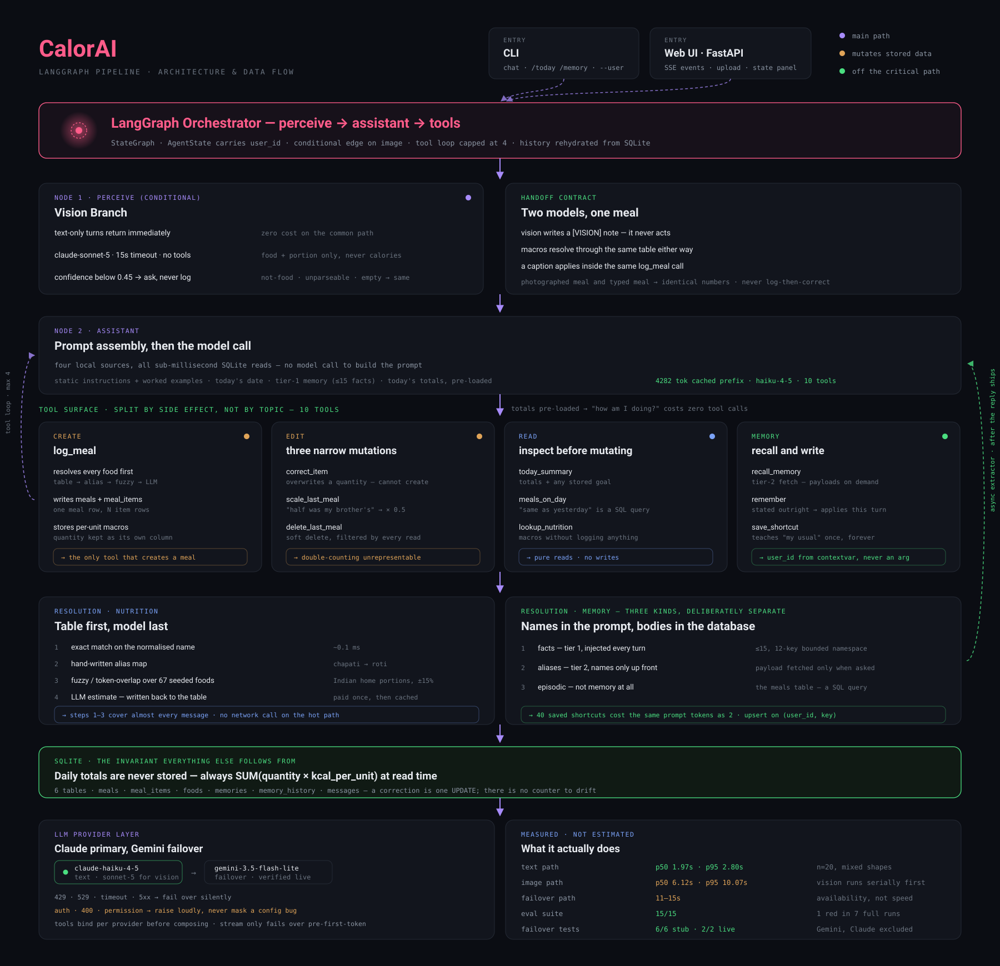

# CalorAI — conversational meal logging agent

A calorie tracker you talk to the way you'd text a friend. No forms, no
dropdowns, no searching a database for "paratha (medium)". You say what you ate;
it gets logged.

An unedited run, transcribed verbatim:

```
you > had 2 parathas and chai for breakfast
calorai > Logged: 2 parathas and chai = 525 kcal.

you > actually that was 3 parathas not 2
calorai > Got it, 3 parathas and chai — 735 kcal now.

you > samples/plate.jpg half of this was my brother's
calorai > Logged: roti, dal, yogurt, veg curry and 2 laddus (your half)
          = 437 kcal. You're at 1172 for the day.

you > how am I doing on calories?
calorai > You're at 1172 kcal for the day. Do you have a target?
```

Note what didn't happen. The correction replaced the parathas rather than adding
to them (525 → 735, not 525 + 630). The photo and its caption became **one**
meal at half portions, not a full meal plus a correction. And 735 + 437 = 1172
exactly, because that total is a `SUM()` over the database rather than anything
the model computed.

**Status:** all six core features implemented. 15/15 evals pass, 6/6 failover
tests pass. Latency measured and reported below. Known gaps are documented in
[Assumptions and trade-offs](#assumptions-and-trade-offs) and
[What I'd build next](#what-id-build-next) rather than left for you to find.

---

## Contents

- [Setup](#setup)
- [Using it](#using-it)
- [Architecture](#architecture)
- [Model choices](#model-choices)
- [How memory works](#how-memory-works)
- [Tool design](#tool-design)
- [Keeping totals correct](#keeping-totals-correct)
- [The image path](#the-image-path)
- [Ambiguity: when to log, when to ask](#ambiguity-when-to-log-when-to-ask)
- [Latency](#latency)
- [Evals](#evals)
- [Failover](#failover)
- [Assumptions and trade-offs](#assumptions-and-trade-offs)
- [Time breakdown](#time-breakdown)
- [What I'd build next](#what-id-build-next)
- [Notes on AI tool usage](#notes-on-ai-tool-usage)

---

## Setup

Python 3.11+. Verified from a clean clone.

```bash
git clone <this-repo> && cd CalorAI
python3 -m venv .venv
.venv/bin/pip install -r requirements.txt
cp .env.example .env
```

Put an API key in `.env`:

```bash
ANTHROPIC_API_KEY=sk-ant-...      # primary
GEMINI_API_KEY=...                # optional, failover only
```

Either key alone works. With both, Claude serves and Gemini catches transient
failures. Placeholder values left in `.env` are treated as absent, so a
half-filled file behaves like a single-provider setup rather than pretending to
have a failover it doesn't have.

Run it:

```bash
.venv/bin/python -m calorai.cli
```

The banner prints which models are actually serving, so a single-provider run is
never mistaken for the intended configuration.

**Optional — LangSmith tracing.** Set `LANGSMITH_TRACING=true` and
`LANGSMITH_API_KEY` in `.env`. LangGraph emits traces automatically; there is
nothing to wire up in the application. I have not verified this end to end —
I don't have a LangSmith key — so the mechanism is present and correctly named
but unproven.

---

## Using it

Attach a photo by putting its path in the message. A path alone logs the photo;
a path plus text is one combined turn.

```
you > samples/plate.jpg
you > samples/plate.jpg half of this was my brother's
```

CLI commands: `/today`, `/memory`, `/meals`, `/user <id>`, `/quit`.

```bash
.venv/bin/python -m calorai.cli --user alice   # session isolation
.venv/bin/python -m calorai.cli --timing       # per-turn latency
.venv/bin/python -m calorai.cli --no-stream    # wait for the full reply
```

### Web UI

A minimal chat interface, mainly for demos and recording. It shows the agent's
*state* alongside the conversation — running totals, logged items, stored
memories, and which tools fired on each turn — because none of that is visible
in a transcript alone.

```bash
.venv/bin/python -m calorai.web     # http://127.0.0.1:8000
```

Attach photos with the paperclip or by dragging them onto the page. The user
dropdown switches sessions, which demonstrates isolation live.

Tests and measurement:

```bash
.venv/bin/python -m evals.run_evals --image samples/plate.jpg
.venv/bin/python -m bench.latency --runs 20 --image samples/plate.jpg
.venv/bin/python -m tests.test_failover        # no API key needed
```

---

## Architecture



The module layout behind that diagram:

```
cli.py       terminal loop, splits an image path out of the message
agent.py     LangGraph state machine — the orchestrator
prompts.py   system prompt assembly (local reads only, no model calls)
tools.py     10 tools; the model's only way to touch data
vision.py    image → food names and portions (never calories)
memory.py    facts / aliases, two-tier read, async write
nutrition.py food name → macros (table first, LLM last)
db.py        SQLite; the single source of truth
```

Dependencies run one way: `cli → agent → {tools, vision, prompts} → {memory,
nutrition} → db`.

The graph is deliberately small:

```
perceive ──→ assistant ──→ tools ──┐
                  ▲                │
                  └────────────────┘
```

`perceive` is the image branch and returns immediately on text-only turns, so it
costs nothing on the common path. Everything after is a standard tool-calling
loop, capped at 4 iterations — a stuck agent is worse than a short answer.

A turn in full:

1. CLI pulls any image path out of the message.
2. `_turn_state` sets the `CURRENT_USER` contextvar and rehydrates the last 8
   messages **from SQLite**, which is why a fresh process resumes mid-thread.
3. `perceive` runs the vision model if there's a photo.
4. `assistant` builds the system prompt from four local sources — static
   instructions, today's date, tier-1 memory, and today's running totals — then
   calls the text model with 10 tools bound.
5. Tools execute; the loop returns to `assistant` for the reply.
6. `_finish` persists the turn, then fires memory extraction on a background
   thread. The user already has their answer.

---

## Model choices

Two providers, three roles. Claude primary, Gemini failover.

| Role | Primary | Failover | Why this tier |
|---|---|---|---|
| text | `claude-haiku-4-5` | `gemini-3.5-flash-lite` | On the critical path for every message. Fastest Claude model with reliable tool calling |
| vision | `claude-sonnet-5` | `gemini-3.5-flash` | Harder perceptual task, runs at most once per turn |
| extractor | `claude-haiku-4-5` | `gemini-3.5-flash-lite` | Off the reply path — latency invisible, so take the cheap model |

*(Was `gemini-2.5-flash(-lite)` — see [Failover](#failover) for why that changed.)*

**Why Claude:** tool-calling reliability is the thing this agent lives or dies
on, and Haiku 4.5 is the fastest model where I trust it. Routing "had 2 rotis"
to a frontier model would be slower and no more correct.

**Why a separate vision model, on substance rather than to tick the box:**
recognising a half-eaten paratha under kitchen lighting is a genuinely different
task from routing text. Sonnet 5 is measurably better at it — on the sample
plate it identifies *bajra roti* and *laddu*, where Haiku guessed *yogurt* and
*pakora*. Text and vision are different model families with different configs
and different timeouts.

**A calibration finding worth stating:** Sonnet reports **lower** confidence
(0.50–0.55) while being **more** accurate; Haiku reported 0.79–0.82 while being
wrong. Haiku is confidently incorrect, Sonnet is accurately unsure. My
`VISION_MIN_CONFIDENCE` threshold is therefore weaker than it looks — see
[trade-offs](#assumptions-and-trade-offs).

**Nutrition data** comes from a 67-food hardcoded table
([`nutrition_seed.py`](calorai/nutrition_seed.py)) weighted toward Indian home
cooking, with an LLM estimate as fallback that writes back to the table so the
same food is never estimated twice. Lookup is exact → alias → fuzzy → LLM.

I chose this over USDA FoodData Central deliberately. The test conversation set
is paratha, roti, chai and biryani; public nutrition APIs are weakest on exactly
those, and they'd add a network round trip to the critical path. A local table
is a sub-millisecond lookup with better coverage for this user base. The cost is
accuracy: values are typical home portions, good to roughly ±15%. That is well
inside the error of someone saying "maybe two thirds of the box".

---

## How memory works

This is the part I spent the most time on.

### Three kinds of memory, deliberately separated

| Kind | Example | Stored in | Retrieved by |
|---|---|---|---|
| **Fact** | "Is vegetarian", "Targets 140g protein" | `memories`, kind=fact | injected into every prompt |
| **Alias** | "my usual" → 2 parathas + chai | `memories`, kind=alias, JSON payload | on demand, via `recall_memory` |
| **Episodic** | what they ate on Tuesday | `meals` table | SQL query |

**Episodic history is not memory.** "same as yesterday" is
`SELECT ... WHERE meal_date = today-1`, not a recall problem. Treating it as one
is both slower and less correct. Conflating these three is the usual failure
mode: dump every meal into a vector store and you get a memory system that is
enormous, slow, and *still* wrong about how many calories you've had today.

### When it's written

**Off the critical path.** After the reply has streamed, a background thread
runs a cheap extraction call over the turn. The user never waits for it.

Writes are upserts on `(user_id, key)` against a **bounded key namespace** — 12
keys, listed in [`memory.py`](calorai/memory.py). This is the mechanism that
stops memory growing without limit: the tenth time someone mentions being
vegetarian it overwrites one row rather than adding a tenth. The extractor is
explicitly forbidden from storing episodic facts, and a confidence floor of 0.55
applies, because a guess is not a memory. Overwrites are recorded in
`memory_history` so a change is explainable.

There's one exception to the async path: the `remember` tool. When a user says
"i'm vegetarian btw", that should apply *this* turn, not next — so the model can
write it synchronously.

### How it's retrieved — the anti-bloat design

**Tier 1, always injected.** Facts only, one short line each, hard-capped at 15
and priority-ordered so the cap drops the least useful first. Plus alias
**names** — a few tokens each.

**Tier 2, on demand.** Alias **payloads** are fetched only when the model calls
`recall_memory`.

That split is the whole trick: **names are cheap and go in the prompt, bodies
are expensive and stay in the database until asked for.** A user with 40 saved
shortcuts pays the same prompt cost as one with two.

Verified across three separate processes: meals persist, memory persists, and
the memory is *used* — process 3 replied "You had chicken? Thought you were
vegetarian."

---

## Tool design

Ten tools, split by **side effect** rather than by topic.

| | Tools |
|---|---|
| **Create** | `log_meal` |
| **Edit** | `correct_item`, `scale_last_meal`, `delete_last_meal` |
| **Read** | `today_summary`, `meals_on_day`, `lookup_nutrition` |
| **Memory** | `recall_memory`, `remember`, `save_shortcut` |

The model's hardest job isn't choosing between "log" and "look up" — it's not
corrupting the day's totals. So every operation that mutates a logged meal is
its own narrow tool whose name says exactly what it does to the data.
`correct_item` **cannot create a meal**; it finds an existing item and overwrites
its quantity.

That separation is why "actually that was 3 rotis not 2" can't double-count. A
single fat `update_meal` tool would be one bad model decision away from logging
five rotis, and no amount of prompt wording reliably prevents that. **Making the
wrong action unrepresentable is cheaper than making it unlikely.**

`user_id` is not a tool argument. It comes from a contextvar set per turn, so the
model cannot address another user's data even if it tries.

---

## Keeping totals correct

The invariant everything else follows from:

> **Daily totals are never stored. They are always `SUM()`'d at read time.**

`meal_items` stores **macros per one unit** and **quantity** separately:

```
name=paratha   quantity=2   kcal_per_unit=210
```

`daily_totals` is `SUM(quantity × kcal_per_unit)`. A correction is one `UPDATE`
of `quantity`: 420 → 630. Nothing to recompute, no counter to drift out of sync.
Deletion is a soft-delete flag the same query filters out.

**A bug worth recording, because the database was never wrong and the product
still was.** On the first live run the agent told the user *1050 kcal* while
SQLite correctly held *525*. The day's total appeared twice in context — in the
tool result and again in the rebuilt system prompt — and the model added them.

My first fix made it worse: I removed the total from the tool result, and it
then invented *786* against a stored *735*. Small models read what's adjacent to
generation, not what's at the top of a 2600-token prompt. The fix that worked
was stating the total **once**, in the tool result, worded to explicitly
supersede the prompt's copy, plus a rule forbidding arithmetic outright:

> Never add, subtract or compute a total yourself. Every number you say must be
> copied from somewhere you were given it.

---

## The image path

The handoff contract: **the vision model identifies food and portion only. It is
never asked for calories.**

Two reasons. A meal photographed and a meal typed then produce byte-identical
numbers, because both go through the same nutrition table. And vision models are
much better at "that's a paratha" than "that's 210 kcal" — asking for the second
invites confident, unverifiable numbers into the database.

Vision returns per-item and overall confidence. Three outcomes:

- confident → hand to the agent to log
- low confidence, not food, or unparseable → `needs_clarification`, the agent
  asks instead of logging
- API error → a clean failure the agent turns into "I couldn't read that photo"

**The agent never silently logs something the vision model was unsure about.** A
wrong meal in the database is worse than one extra question.

### Photo + caption must be one meal

Vision does not act. It writes a `[VISION]` note into the system prompt and the
text model does all the reasoning:

```
[VISION] The photo shows: 1 piece roti, 0.5 bowl curd, 2 piece laddu
(confidence 0.55).
Log this NOW as ONE meal with a single log_meal call...
The user's message this turn is a caption on THIS photo. It is not a
correction to anything logged earlier, even if it is worded like one.
'half of this was my brother's' means: multiply the quantities above and log
the result ONCE. Do NOT call scale_last_meal...
```

Two independent passes would produce two meals, or a meal plus a correction —
either way a wrong total and two replies to one message.

Three bugs here were only visible with a real photo in hand, and all three are in
the git history:

1. **The shipped vision default didn't work at all.** Sonnet 5 rejects
   `temperature`; I passed it unconditionally, so every Sonnet call 400'd. Eval
   runs pinned Haiku, which accepts it — so the *tested* config worked and the
   *shipped* one didn't.
2. **Image-only turns fed a placeholder string to the vision model as the user's
   caption.** It tried to reconcile `[sent a photo of their food]` with the plate
   and returned *idli, dosa, sambar* for a photo of roti, curd and laddu.
3. **A few-shot example collided with the caption case.** It taught that "half of
   this was my brother's" means `scale_last_meal`; with a photo attached the same
   words are a caption on the new meal.

---

## Ambiguity: when to log, when to ask

Over-asking kills the experience; under-asking produces garbage. The line I drew,
stated explicitly in the prompt and demonstrated with worked examples:

**Log without asking** when the food is identifiable and the portion inferable.
"some almonds" logs as a handful — being wrong by 30 kcal doesn't matter, and
asking teaches the user that logging is expensive.

**Ask** only when the food itself is unnamed ("grazed all afternoon" — on what?)
or when the portion is unknown *and* would swing calories by more than ~40%.

**One question maximum**, specific, answerable in three words.

**Never ask permission.** "Want me to log that?" is always wrong — they told you
what they ate, which is why they messaged. This was a real bug the eval caught:
after being told what "my usual" meant, the agent saved the shortcut and then
asked whether to log it.

`"skipped lunch"` logs nothing. A skipped meal is zero calories, not an entry.

---

## Latency

Measured over a mix of message shapes — plain logs, corrections, queries,
fractional portions — not just easy cases. `bench/latency.py`.

| Path | p50 | p95 | mean | n |
|---|---|---|---|---|
| **text** | **1.97s** | **2.80s** | 1.91s | 20 |
| text, first token | 1.61s | 2.65s | — | 20 |
| **image** (Sonnet vision, shipped) | **6.12s** | **10.07s** | 6.88s | 8 |
| image (Haiku vision) | 6.39s | 7.41s | 6.31s | 10 |

### What I did to get there

**1. Disabled Gemini's thinking pass** (`thinking_budget=0`). For "had 2 rotis"
the internal reasoning pass costs more wall-clock than the rest of the turn and
buys nothing. Largest single lever on the Gemini path.

**2. Pre-loaded today's totals into the system prompt.** "How am I doing?" is
answered with **zero tool calls** — a whole model round trip saved on one of the
most frequent messages a user sends.

**3. Moved memory writes off the critical path.** ~300–600ms per turn. The cost
is that a fact stated in message N may not be retrievable until N+1; the
`remember` tool covers the cases where that would be noticeable.

**4. Local nutrition table.** No network call on the hot path. Only a genuine
miss costs a model call, and it caches back.

**5. `max_retries=0` on the text path.** The SDK retries twice with exponential
backoff by default — seconds burned before the fallback is even reached. On a
messaging product a fast answer from the backup beats a slow one from the
primary. The extractor keeps its retries; nobody waits on it.

**6. Timeouts set from measurement, not guesswork.** An earlier 6s default was
cutting off a *healthy* 8.8s call — "leftover biryani, maybe two thirds of the
box", which the model gets right, it just thinks longer — and turning a correct
answer into a hard failure. Now 10s, above the slowest observed real call.

**7. Prompt caching**, with the cache breakpoint placed after the static
instructions and before per-user state, so eating a meal can't invalidate the
prefix. Details below.

### What's slow, and why I didn't fix it

**The image path at 6.1s p50 is not messaging speed.** Vision is ~2.6s and the
text turn runs *after* it, serially. It's serial because the text model needs to
know what's on the plate before it can decide anything. The obvious fix —
speculatively resolving nutrition for likely foods while vision runs — is real
work with modest payoff, and I ran out of budget before quality work I valued
more. It's the first thing on [what I'd build next](#what-id-build-next).

**Streaming buys almost nothing here.** First token p50 1.61s against a total of
1.97s. The user-visible text is generated *after* the tool round trip, so there's
little to stream. It's implemented and it works, but it isn't the latency story
and I'd rather say so than let the number imply otherwise.

### Prompt caching, and one thing I got wrong

Anthropic enforces a per-model **minimum cacheable prefix**. I initially
concluded caching was unavailable on this API key. That was wrong, and measuring
properly showed why:

```
claude-haiku-4-5    4059 tok → not cached    4509 tok → cached   (floor 4096)
claude-sonnet-5     4803 tok → cached
```

My prefix was ~2583 tokens — *just* under Haiku's floor. Not the key; my prompt
was too small.

Rather than pad with filler to cross the threshold, I spent the 1500-token gap on
content that earns its place: worked examples of the log-vs-ask judgement,
correction handling, portion conventions, meal typing. **One of those examples
immediately fixed a real behavioural bug** (the permission-seeking above). The
prefix is now 4282 tokens and caching engages.

Per-call input cost on Haiku 4.5 ($1.00/MTok input, 1.25× write, 0.1× read):

| | tokens | cost |
|---|---|---|
| before | 2583 uncached | $0.002583 |
| cache write | 4282 write + 350 | $0.005703 |
| cache read | 4282 read + 350 | **$0.000778** |

Cache reads are **70% cheaper than the original**, despite carrying 66% more
content. Break-even is ~2 hits per write. Each tool-using turn makes two model
calls sharing one prefix, so a single multi-turn exchange clears it — **but the
default TTL is 5 minutes**, so a user who logs breakfast and says nothing for
four hours pays the write and never collects. Bursty sessions win; sparse ones
lose about 25%. A 1h TTL costs 2× on write and pushes break-even to ~4 hits,
which a meal logger won't reach either, so I left it at 5 minutes.

Latency was unchanged by the extra tokens: p50 2.33s vs 2.38s before.

**To be clear about the reasoning: caching is not the justification for that
content — prompt quality is.** The examples earn their place on behaviour alone.
If the cache economics were flatly negative I'd keep the content and drop the
`cache_control`.

---

## Evals

`evals/run_evals.py` — **15/15 passing.**

**The suite is not deterministic, and you should expect an occasional red run.**
Every case drives a real model, so a borderline judgement can land differently
between runs. Observed rate while writing this: one failure across seven full
runs, on a case that passed on every retry. I am reporting that rather than
quoting a clean 15/15 and letting you discover it, because a suite that passes 6
times in 7 is a different claim from one that passes always.

The fix is not to loosen the assertions until everything is green — the
assertions are the point. It's to run borderline cases N times and require a
pass rate, which is on [what I'd build next](#what-id-build-next).

Cases are graded on **the state of the database after each turn**, not on the
wording of the reply. A meal logger is correct when the right foods, the right
quantities and the right running total are stored. Reply-text assertions are used
only where the product behaviour *is* the reply — the agent must ask rather than
invent food for "grazed all afternoon".

Each case runs against a clean slate for its own user, so multi-turn behaviour
(correct, then query; teach a shortcut, then use it) is tested as a sequence.

Covered: basic logging · correction without double-counting · fractional portions
· under-specified input · totals and macro queries · memory writes · shortcut
recall across sessions · teaching a shortcut · "same as yesterday" · photo ·
photo + caption · vegetarian awareness · deletion · session isolation.

**One eval failure worth admitting.** The image case originally asserted only
`meal_count(1)` — and it passed green while the vision model was reporting
"idli, dosa, sambar" for a plate of roti, curd and laddu. One meal *was* logged,
so the assertion held. Image cases now assert against the photo's actual
contents. A weak eval is worse than no eval, because it tells you you're fine.

---

## Failover

Claude primary, Gemini failover, across all three roles.
`tests/test_failover.py` — **6/6, no API keys required** (stub runnables).

**Only transient failures fail over:** rate limits, 529 overload, timeouts,
connection errors, 5xx.

**Auth, permission and bad-request errors raise loudly.** Failing over on those
would hide a config bug forever — the app would look healthy while running
permanently on the backup, and nobody would find out until the second key also
expired. This is not hypothetical: the Sonnet `temperature` bug above was a 400,
and with a Gemini key configured a naive fallback would have silently masked it.

**Tools bind to each provider before the fallback is composed.**
`with_fallbacks()` returns a plain Runnable with no `.bind_tools()`, so binding
after composing fails outright — and binding only the primary would hand the user
a *toolless agent* the moment a failover fired. It would chat happily and log
nothing.

**Streaming.** `RunnableWithFallbacks.stream()` pulls the first chunk inside the
try block, so it only fails over *before any token is emitted*; after that a
mid-stream error propagates. That's the behaviour you want — a user must never
see half a Claude reply followed by a fresh, different Gemini reply. I read the
source to confirm rather than assuming, and the test pins it.

### Verified live, not just with stubs

`CALORAI_PROVIDER=google` forces every role onto Gemini with Claude excluded
entirely — confirmed first via `llm.have_anthropic()` reporting `False`, so this
is provably not falling back to Claude by accident. `basic_log` and
`correction_no_double_count` then ran end to end on Gemini alone:

```
had 2 parathas and chai for breakfast   → Logged: 2 parathas and chai = 525 kcal.
actually that was 3 parathas not 2      → Got it, bumped to 3 parathas — 735 kcal now.
```

Correct tool calls, correct totals — 735, not 1155, so the no-double-count
invariant holds on the provider that had never actually been exercised. Getting
here needed two fixes, both found by the live key rather than by reasoning about
the SDK in the abstract:

**1. The shipped fallback models were dead on any new key.** `gemini-2.5-flash`
and `gemini-2.5-flash-lite` are still listed by `client.models.list()` — not
globally retired — but generation on them 404s for accounts created after some
cutoff: *"gemini-2.5-flash-lite is no longer available to new users."* An old
developer key keeps working while a fresh one silently can't call the model
that key's own account is pointed at by default. Fixed by pulling the live
model list rather than trusting the error string alone, and moving to
`gemini-3.5-flash(-lite)`.

**2. `thinking_budget=0` — the exact setting used to disable Gemini's reasoning
pass and the main lever in the [latency](#latency) section — is rejected
outright on `gemini-3.5-flash-lite`: a bare 400 with no further detail. Every
other value tried (1, -1/dynamic, 128) was accepted. Isolated by bisecting
kwargs on a bare call rather than guessing from the error, which said nothing
useful. Fixed by moving the default from 0 to 1, the smallest valid budget —
functionally the same "skip the reasoning pass" intent, and confirmed not to
regress accounts still on the 2.5 line.

**What this did and didn't prove.** It confirms Gemini produces correct tool
calls under this system's actual prompt and tool schema — the thing that was
genuinely unverified before. It does not simulate a live Claude outage
triggering the fallback path in production; that part is still proven by the
stub tests only. And it surfaced a real cost of failover worth stating plainly:
these Gemini calls ran **11–15s** end to end, against Claude's sub-3s on the same
cases. The timeout budgets above bound a single HTTP request; a full turn is at
least two model calls (decide to call a tool, then respond to its result), so
total turn time on the failover path is well above what a single-call timeout
figure implies. Failover buys availability, not comparable speed — worth
knowing before assuming a Claude outage degrades gracefully rather than just
getting much slower.

---

## Assumptions and trade-offs

**Nutrition is approximate.** A 67-food table of typical Indian home portions,
±15%. Deliberate: better coverage than a US-centric API for this user base, and
no network call on the hot path. A user weighing food on a scale would find it
frustrating.

**Failover is now verified with a live Gemini call, and it needed two fixes to get
there.** `CALORAI_PROVIDER=google`, `basic_log` and `correction_no_double_count`
run entirely on Gemini: correct tool calls, correct totals (525 → 735, not 1155
— no double-count on the provider that was never explicitly tested). See
[Failover](#failover) for the two bugs a live key surfaced and what they cost.

One caveat the test itself surfaced: these Gemini calls ran **11–15s**, against
Claude's sub-3s. Failover buys availability, not speed — when it actually fires,
expect a much slower turn, not a comparable one.

**`VISION_MIN_CONFIDENCE` is weaker than it looks.** It's a single threshold
(0.45) across models that calibrate differently — Sonnet says 0.50 while correct,
Haiku said 0.79 while wrong. The threshold catches catastrophic failures but is
close to meaningless as a quality signal. Per-model thresholds, or dropping the
number in favour of behavioural checks, would be more honest.

**Memory extraction lags one turn.** Async by design; the `remember` tool covers
the cases where it would be noticeable, but the background extractor is genuinely
behind.

**Dates use server-local time.** No per-user timezone. Fine for a demo, wrong for
a real WhatsApp product where "today" depends on where the user is.

**No re-dating.** "That was yesterday not today" is unsupported; the agent says so
plainly rather than pretending to have moved it. I'd rather it admit a missing
capability than fake one.

**The sample photo is a stock image** — evenly lit, centred, unobstructed. Real
WhatsApp food photos are half-eaten plates in bad light with a hand in frame. The
vision numbers here are an **optimistic bound**, not a representative one.

**SQLite, single process.** Right for this; would need Postgres and a connection
pool for real concurrency.

**Conversation history is capped at 8 messages** rehydrated per turn. Long
sessions lose early context. The memory store is what's meant to carry anything
durable — which is the design, but it means the boundary between "in history" and
"in memory" is a real seam.

---

## Time breakdown

Roughly 8 hours of implementation. Proportions are what matter more than the
absolute numbers:

| Area | Share | Notes |
|---|---|---|
| Memory design and implementation | ~2h | The part the brief said mattered most, and the part I'd defend hardest |
| Schema, totals correctness, tools | ~1.5h | Most of the value is in the schema decision, which took longer to decide than to write |
| Debugging live-model bugs | ~1.5h | Doubled totals, empty streaming, the vision default. None visible offline |
| Image path | ~1h | Including three bugs only a real photo surfaced |
| Failover + provider abstraction | ~1h | Added mid-project when Claude became primary |
| Evals and latency harness | ~1h | Paid for itself repeatedly |
| README | ~0.5h | |

The single most useful hour was the one spent making the *evals* good. Three of
the bugs above were caught by an eval going red, and one was caught by noticing
an eval passing when it shouldn't have.

---

## What I'd build next

In priority order.

1. **Parallelise the image path.** 6.1s p50 is the weakest number here. Kick off
   nutrition resolution for likely candidates while vision is still running, and
   start the text turn on partial vision output. Realistically 1.5–2s.
2. **Exercise the failover for real.** One forced `CALORAI_PROVIDER=google` run
   across the eval suite. Right now I can prove the routing, not the quality.
3. **Per-model confidence thresholds**, or replace the confidence gate with a
   behavioural one — ask when the *item list* is internally inconsistent rather
   than when a self-reported number is low.
4. **Per-user timezones.** A day boundary that depends on the server is wrong for
   the product this is meant to be.
5. **Re-dating and meal editing by reference** — "move that to yesterday", "the
   dal at lunch, not dinner".
6. **Flake-resistant evals.** Cases that exercise a borderline judgement should
   run N times and require a pass rate, rather than passing or failing on a
   single sample of a nondeterministic system. Today one run is one sample.
7. **An eval set with adversarial cases**: contradictory corrections, a photo of
   something that isn't food, a user who changes dietary restriction mid-history.
8. **Postgres + proper concurrency** if this were going anywhere near real
   traffic.
9. **Memory consolidation.** Facts currently only ever overwrite. Over months
   you'd want summarisation and decay — "was vegetarian, now eats fish" is a
   history, not a single value.

---

## Notes on AI tool usage

Built with **Claude Code** (Opus 5), which is the intended way to work here.

**What it was genuinely good at:** writing the SQLite layer and tool surface from
a stated invariant; grinding through cross-provider incompatibilities
(Anthropic's content-block format vs Gemini's, `temperature` acceptance per model
family) by *testing* them rather than guessing; and turning "measure the cache
floor" into a binary search that produced an actual number instead of a citation.

**Where the judgement had to be human:** the memory architecture — the
three-way split, the bounded key namespace, names-in-prompt/bodies-in-DB — is a
design decision, and the first instinct of most tooling here is a vector store
over every message, which would have been slower, larger and less correct. Same
for the tool split: "make the wrong action unrepresentable" is a stance, not a
completion.

**The most valuable pattern** was refusing to trust anything unverified. Almost
every finding in this README came from running something and being surprised:

- Prompt caching "not available on this key" — wrong; measured the floor.
- Streaming "implemented" — emitted nothing on Anthropic for 20+ minutes of
  green tests.
- Vision "working" — the shipped default 400'd on every call.
- An eval "passing" — while the model logged idli and dosa for a plate of roti.

Every one of those looked fine until it was actually run. The commit history
shows them being found and fixed rather than a clean narrative written
afterwards, which is the more useful artefact.
